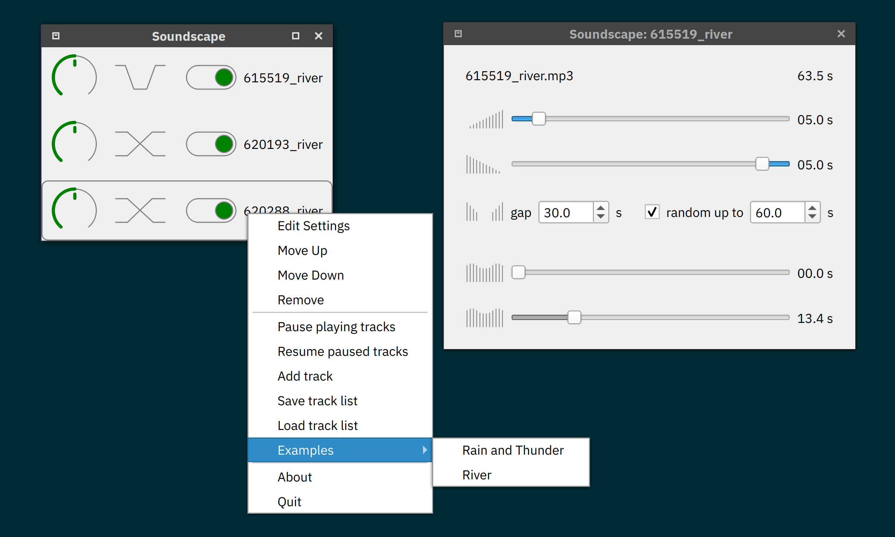

# soundscape-qt

[**soundscape-qt**](https://github.com/ddanilov/soundscape-qt) is an open source
desktop application to play a mix of sounds, e.g. natural sounds produced by
animals or wind and water.

## Usage

**soundscape-qt** itself comes with no sounds, however you can use example
soundscapes provided in
[soundscape-examples](https://github.com/ddanilov/soundscape-examples)
repository to test the functionality of the application. Load one of the
`*.json` files into the application, and it will import and play the included
media files. Use mouse right-click in the main window or on the tray icon to
access application menu where you can add or remove soundtracks and change their
settings.

[Freesound](https://freesound.org/) is a good source of sounds for your own
soundscapes.

## Installation

Prebuilt binaries for Microsoft Windows are avaiable from the
[Releases page](https://github.com/ddanilov/soundscape-qt/releases).
